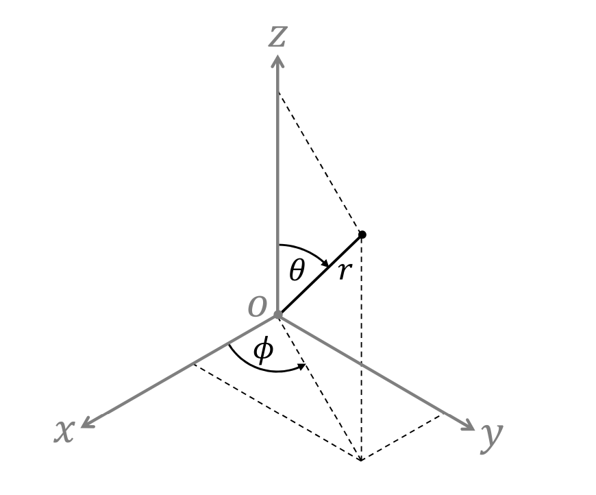

# SHAASP 
Spherical Harmonic And Audio Signal Processing (SHAASP) MATLAB functions

Matlab functions for common equations in simulating spherical harmonics, sound fields, point sources, planewaves, and audio signals. 

## Getting Started
1. Add the +shaasp folder to your Matlab workspace
2. Call functions by "shaasp.function_name"

## Notations
| | |
|-|-|
| x,y,z | Cartisian coordinates, x = forward, y = right, z = up |
| $(r,\theta,\phi)$ | Spherical coordinates, r = radius (metres), $\theta \in [0,\pi]$ elevation angle downwards from +z axis, $\phi \in [0, 2\pi)$ azimuth angle counterclockwise from +x axis |
| k | Wavenumber |
| N | Trunction Order |
| (n, m) (v, u) | Harmonic (order, mode) |
| $\alpha_{nm}$ | Spherical harmonic coefficients of interior sound field |
| $\beta_{nm}$ | Spherical harmonic coefficients of exterior sound field |
| $a_{nm}$ | Planewave Density (PWD) function coefficients |
| $j_n(\cdot)$ | Spherical Bessel function of first kind |
| $h_n(\cdot)$ | Spherical Hankel function of first kind |
| $Y_{nm}(\cdot)$ | Complex spherical harmonic basis functions |
| $G(k,\mathbf{x},\mathbf{y})$ | Green's function describing sound pressure at a receiver of position $\mathbf{x}$ due to sound source of position $\mathbf{y}$ |
| $P(k, \mathbf{x})$ | Sound pressure at receiver of position $\mathbf{x}$ | 

### Coordinates


*Coordinate notation*

### References

Math *should* follow the definitions in:

[E.G. Williams, Fourier Acoustics: Sound Radiation and Nearfield Acoustic
Holography, Academic Press, London, UK, 1999.]

[D. L. Colton, R. Kress, and R. Kress, Inverse acoustic and electromagnetic
scattering theory, vol. 93, Springer, 1998.]

## Sound Field Functions

Sound field pressure measured by a sound receiver / microphone at position $\mathbf{x}$ due to a sound source at position $\mathbf{y}$.

### Point source Green's function
$ G(k, \mathbf{x}, \mathbf{y}) = \frac{e^{ik|\mathbf{x} - \mathbf{y}|}}{|\mathbf{x} - \mathbf{y}|} $
```
[G] = shaasp.sfd_greens('ps', k, source_position[x,y,z], mic_position[x,y,z]);
```


### Planewave Green's function
$ G(k, \mathbf{x}, \hat{\mathbf{y}}) = e^{-ik\hat{\mathbf{y}} \cdot \mathbf{x}} $
```
[G] = shaasp.sfd_greens('pw', k, source_position[x,y,z], mic_position[x,y,z]);
```
Note that for planewave, the source position [x,y,z] is a unit vector pointing to the planewave's angle of incidence.

## Spherical Harmonic Functions

### Complex spherical harmonics basis functions
$ Y_{nm}(\theta,\phi) = \sqrt{\frac{2n+1}{4\pi}\frac{(n-m)!}{(n+m)!}} \mathcal{P}_{nm}(\cos{\theta}) e^{im\phi} $
- where $\mathcal{P}$ are the associate Legendre functions including the $(-1)^m$ Condon-Shortley phase term.
```
[Y] = shaasp.sph_ynm(N, theta, phi)
```
- Returns $Y_{nm}$ for all $(n,m)$ combinations [(0,0), (1,-1), (1,0), (1,+1), (2,-2), ... (N,+N)]

### Spherical Bessel function (first kind)
$ j_{n}(kr) = \frac{1}{\sqrt{kr}} \sqrt{\frac{\pi}{2}} J_{(n+0.5)}(kr) $
- where $J$ is the Bessel function of first kind given by ```besselj``` function.
```
[j] = shaasp.sph_jn(N, k, r)
```
- Returns all (n,m) for [(0,0), (1,-1), (1,0), (1,+1), (2,-2), ... (N,+N)]

### Spherical Hankel function (first kind)
$ h_{n}(kr) = \frac{1}{\sqrt{kr}} \sqrt{\frac{\pi}{2}} H_{(n+0.5)}(kr) $
- where $H$ denotes the Hankel function from ```besselh```. 
```
[h] = shaasp.sph_hn(N, k, r)
```
- Returns all (n,m) for [(0,0), (1,-1), (1,0), (1,+1), (2,-2), ... (N,+N)]

## Spherical Harmonic Examples

### Example: spherical harmonic coefficients
Interior sound field spherical harmonic coefficients:

$ \alpha_{nm}(k) = i k h_{n}(kr) Y_{nm}^{*}(\theta, \phi) $
- where $(r,\theta,\phi)$ is the source position.
```
% Setup acoustic environment.
sfd_f = 1000;  % Source / sound field frequency.
c = 343;  % Speed of sound.
k = 2 * pi * sfd_f / c;  % Wavenumber.

src_r = 1;  % Source position.
src_theta = pi/2;
src_phi = 0;

mic_r = 0.042;  % Microphone radius / Region of interest.

% Simulate spherical harmonic coefficients.
N = ceil(k * mic_r);  % Truncation order.
alphas = 1i .* k .* shaasp.sph_hn(N, k, src_r) .* conj(shaasp.sph_ynm(N, src_theta, src_phi));
```

### Example: spherical harmonic sound field reconstruction
Reconstruct pressure at microphone in spherical harmonic sound field described by alpha coefficients.

$ P(k,\mathbf{x}) = \sum_{n=0}^{N} \sum_{m=-n}^{n} \alpha_{nm}(k) j_{n}(kr) Y_{nm}(\theta, \phi) $
- where $\mathbf{x} \equiv (r,\theta,\phi)$ is the receiver/mic position.

```
% Continuing above example.
mic_theta = pi/2; % Microphone position.
mic_phi = 0;

% Reconsturct SH sound field at microphone.
p = sum(alphas .* shaasp.sph_jn(N, k, mic_r) .* shaasp.sph_ynm(N, mic_theta, mic_phi), 2);
```

Check the spherical harmonic sound field by comparing to Green's function sound field of the same point source and receiver.
```
g = shaasp.sfd_greens('ps', k, shaasp.rtp2xyz(src_r, src_theta, src_phi), shaasp.rtp2xyz(mic_r, mic_theta, mic_phi));

% results:
disp(p); % p = 0.0355 - 0.0878i
disp(g); % g = 0.0222 - 0.0801i
```
Note that the results do not match. This is due to truncation error, as the spherical harmonic sound field is truncted to N = 1st order. Changing the spherical harmonic's sound field trunction to N = 10 shows that the sound fields do match.
```
N = 10;
alphas = 1i .* k .* shaasp.sph_hn(N, k, src_r) .* conj(shaasp.sph_ynm(N, src_theta, src_phi));
p = sum(alphas .* shaasp.sph_jn(N, k, mic_r) .* shaasp.sph_ynm(N, mic_theta, mic_phi), 2);

% results:
disp(p); % p = 0.0222 - 0.0801i
disp(g); % g = 0.0222 - 0.0801i
```

### Example: spherical harmonic measurement
Estimate the sound field coefficients $\alpha$ from a microphone recording of pressures $P(k,\mathbf{x})$.

First simulate the recording of a sound field by Green's function to get the pressure at each microphone due to the point source.
```
% Get microphone array positions.
[mic_r, mic_theta, mic_phi] = shaasp.sampling_positions_em32_eigenmike();

% 'Record' sound field by Green's function to get pressure at each
% microphone due to the point source.
mic_pressure = shaasp.sfd_greens_sphcoord('ps', k, [src_r, src_theta, src_phi], [mic_r, mic_theta, mic_phi]);
```

Estimate the sound field coefficients by the sphercial harmonic analysis equation:

$ \alpha_{nm}(k) \approx \frac{1}{j_{n}(kR_{q})} \sum_{q=1}^{Q} w_{q} P(k, \mathbf{x}_{q}) Y_{nm}^{*}(\theta_{q}, \phi_{q}) $
- where $q = [1, ..., Q]$ index the number of microphones
- $w_{q}$ are array sampling weights
- $R_{q}$ is the radius of the array

In practice, numerical optimisation can be used by:

$ \mathbf{A}(k) = \text{pinv}(\mathbf{j}(k) \, \mathbf{Y}) * \mathbf{P}(k) $
- where pinv() denotes Moore-Penrose pseudoinverse
- $\mathbf{A}$ is the [(N+1)^2 by 1] set of $\alpha_{nm}(k)$ coefficients
- $\mathbf{j}$ and $ \mathbf{Y}$ are [Q by (N+1)^2] matrices of $j_{n}(kr_{q})$ and $Y_{nm}(\theta_{q}, \phi_{q})$ terms
- and $\mathbf{P}$ are the [Q by 1] microphone array pressures 
```
N = 1;  % Change back to first order, was 10 from previous example.
measured_alphas = pinv(shaasp.sph_jn(N, k, mic_r) .* shaasp.sph_ynm(N, mic_theta, mic_phi)) * mic_pressure;

% Compare to theory.
disp([measured_alphas, alphas(1:4).']);
  %  0.2432 - 0.1429i   0.2432 - 0.1429i
  % -0.1588 - 0.3075i  -0.1588 - 0.3074i
  %  0.0001 + 0.0000i  -0.0000 - 0.0000i
  %  0.1588 + 0.3075i   0.1588 + 0.3074i

```


## License

This project is licensed under the [BSD 3-Clause License](LICENSE).